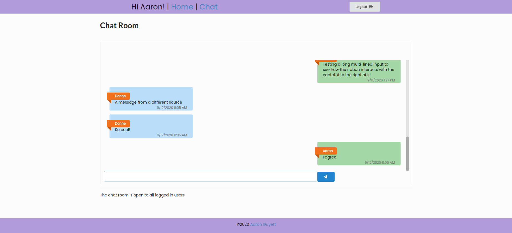
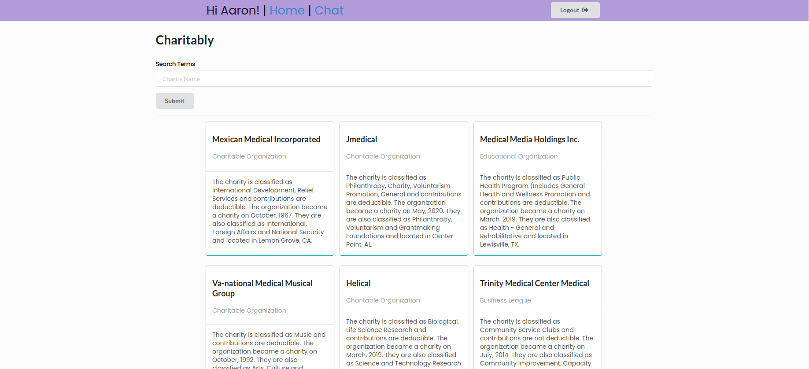

# Charitab.ly
A super lightweight app that allows users to search for a charity and then discuss it in a chat room.
* Live link: [Charitably](https://charitably-e3477.web.app/)

## Features
Users are able to login with Google and then search for a charity. 100 charities are requested. They can then chat about the charities in a room.

## Images



## Getting Started
```
Login
Search
Chat
```

## Technologies Used
* Hosting: Firebase
* Backend: Firebase Realtime Database
* Authentication: Firebase
* Chat: Firebase
* Styling: Semantic UI
* React
* Node
* Express
* Node Packages:dotenv, morgan, react-router-dom, request, serve-favicon

## APIs Integrated
* Charity Information: [Charity Navigator](https://www.charitynavigator.org/index.cfm?bay=content.view&cpid=1397)

## User Stories
* Users can login with Google.
* Users can search for a charity.
* Users can chat in an open room.

## Goals
* Users can chat 1:1
* Users can filter based on different criteria.
* Charity images
* Users can share charity info directly to chat.